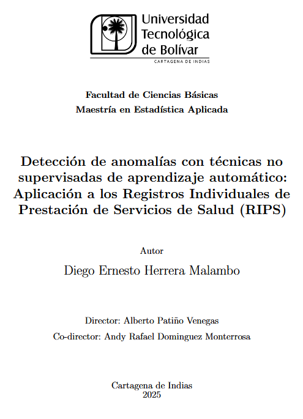
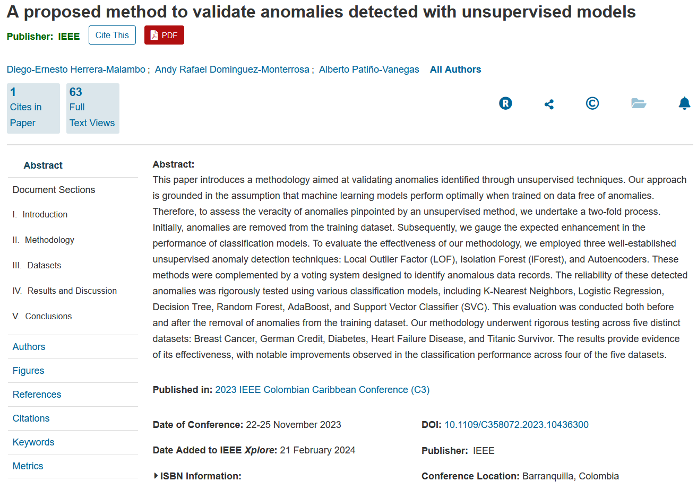
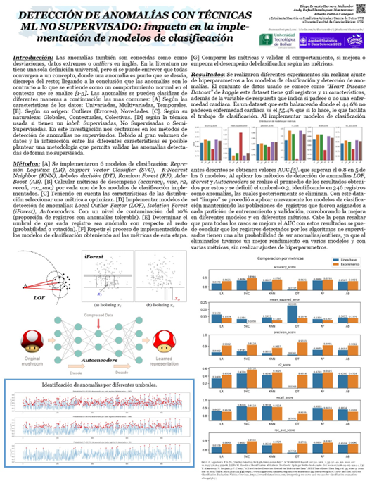

# Deteccion de anomalias con metodos no supervisados

Repositorio soporte para mi tesis de maestria en estadistica aplicada cono titulo:
* **[Detección de anomalías con técnicas no supervisadas de aprendizaje automático: aplicación a los Registros Individuales de Prestación de Servicios de Salud (RIPS). Universidad Tecnológica de Bolívar UTB, 2025.](https://primo.utb.edu.co/permalink/57UTB_INST/cbdp3c/alma99694431305731)**
* **[A proposed method to validate anomalies detected with unsupervised models.](https://ieeexplore.ieee.org/document/10436300)**

